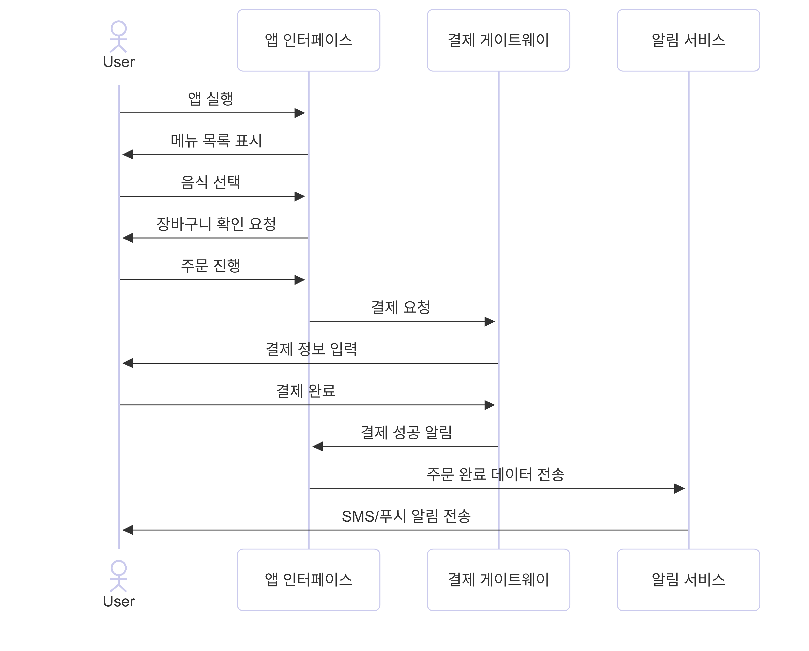

# FoodDeliverySystem
소프트웨어공학 개인 실습 과제 1

# 일상 속 소프트웨어 시스템: 음식 배달 앱

## 1. 시퀀스 다이어그램

### Mermaid 코드
- [시퀀스 다이어그램 코드 전체 보기](./sequence_diagram.md)

### 시퀀스 다이어그램 이미지  

## 2. 샘플코드

### Python 코드
- [샘플 코드 전체 보기](./food_delivery_app.py)

### 코드 구조
- `PaymentGateway`: 결제 처리
- `NotificationService`: 알림 전송
- `FoodDeliveryApp`: 주문 프로세스 관리

## 3. 모듈 평가

### 각 모듈의 역할과 구조

- **PaymentGateway 클래스**  
  결제 처리만 담당합니다. 결제와 관련된 기능이 이 클래스에만 모여 있습니다.

- **NotificationService 클래스**  
  주문이 완료되었을 때 사용자에게 알림을 보내는 역할만 담당합니다. 알림과 관련된 기능이 이 클래스에만 모여 있습니다.

- **FoodDeliveryApp 클래스**  
  메뉴 표시, 장바구니 추가, 결제 요청, 알림 전송 등 전체 주문 과정을 관리합니다.

### 모듈 간 관계

- 각 클래스는 자신의 역할에 집중하고, 필요한 경우에만 서로 정보를 주고받습니다.
- 예를 들어, FoodDeliveryApp은 결제가 필요할 때만 PaymentGateway에 결제를 요청하고, 결제가 완료되면 NotificationService에 알림을 보내달라고 요청합니다.
- 각 클래스의 내부 동작은 다른 클래스에 영향을 주지 않으므로, 한 모듈을 수정해도 다른 모듈에는 영향이 적습니다.

### 결론 (응집도와 결합도 중심)

- **응집도**:  
  각 모듈이 한 가지 역할에 집중하여, 관련된 기능이 한 곳에 잘 모여 있습니다.  
  (예: 결제는 PaymentGateway, 알림은 NotificationService)

- **결합도**:  
  각 모듈이 필요한 정보만 주고받으며, 서로 깊게 연결되어 있지 않습니다.  
  그래서 한 모듈을 수정해도 다른 모듈에는 영향을 거의 주지 않습니다.

- 이러한 구조 덕분에 프로그램이 이해하기 쉽고,  
  유지보수나 확장이 필요할 때도 편리합니다.
---

> 잘못된 점이나 수정할 부분이 있으면 언제든 말씀해 주세요!
